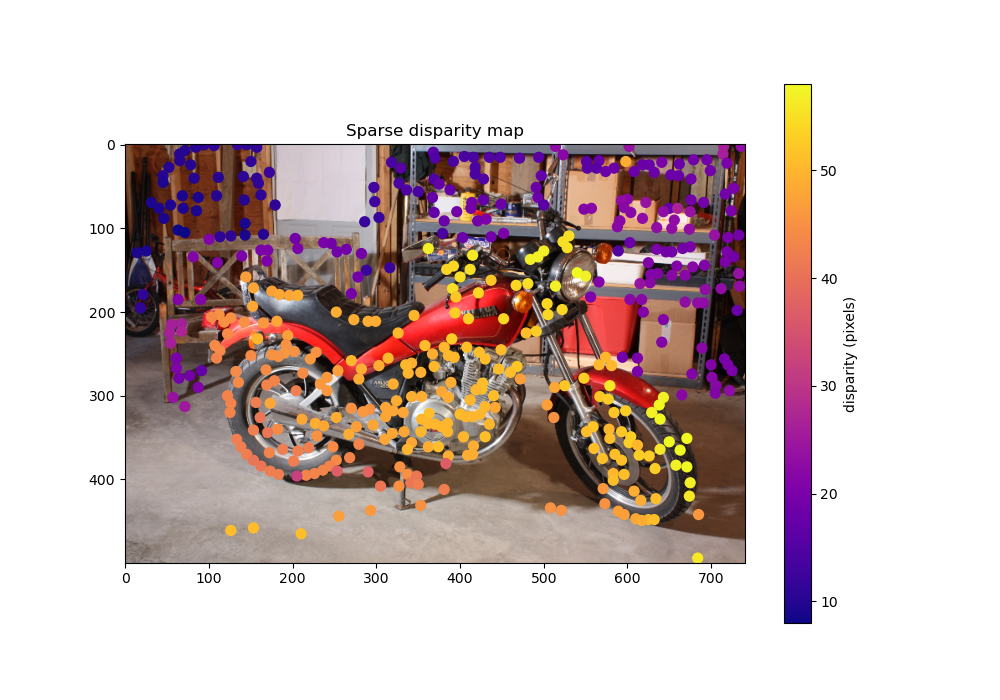
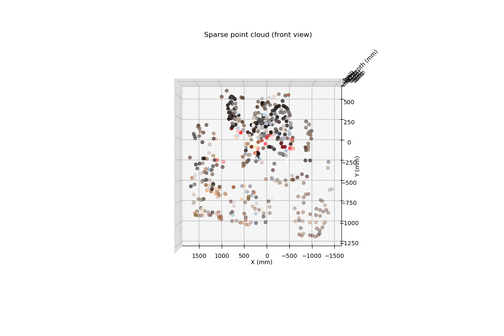
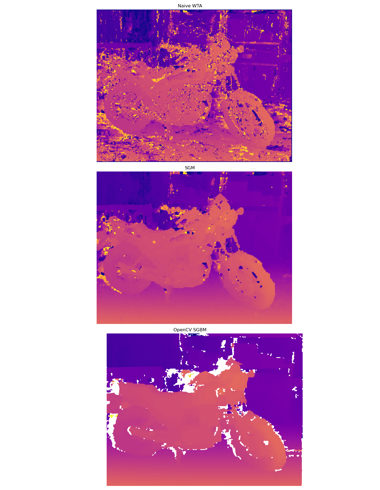
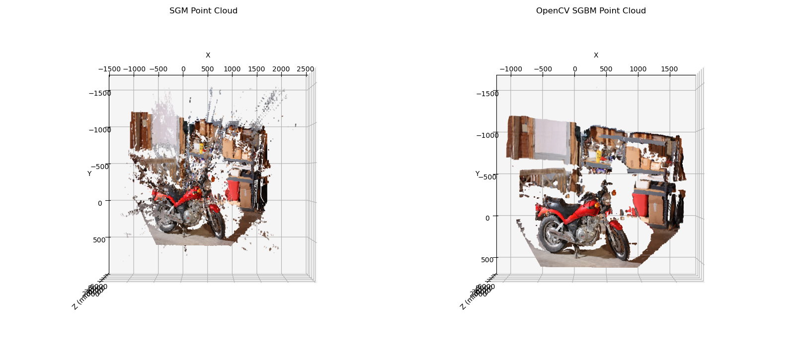

# Stereo Vision from Scratch

A NumPy-only implementation of stereo depth estimation via two approaches:

1. **Sparse Matching** — Harris corners + patch descriptors + epipolar filtering → 3D point cloud
2. **Semi-Global Matching (SGM)** — dense cost volume + dynamic programming aggregation → dense disparity map

Dataset: [Middlebury Motorcycle-perfect](https://vision.middlebury.edu/stereo/) stereo pair, resized to 741×500 (0.25× scale).

---

## Pipeline Overview

```
Stereo Image Pair (im0, im1)
        │
        ├──► Sparse Matching
        │       │
        │       ├─ Harris Corner Detection
        │       ├─ Patch Descriptor Extraction
        │       ├─ SSD Matching + Lowe's Ratio Test
        │       ├─ Epipolar Constraint Filtering
        │       └─ Disparity → 3D Point Cloud
        │
        └──► Semi-Global Matching
                │
                ├─ Cost Volume (block SSD)
                ├─ Naive Winner-Take-All
                └─ SGM Path Aggregation (in progress)
```

---

## Part 1 — Sparse Matching

### 1. Gradient Computation (Sobel Filters)

The image gradients are estimated by convolving the grayscale image with the Sobel kernels:

```
        ┌ -1  0  1 ┐           ┌ -1 -2 -1 ┐
Kx =    │ -2  0  2 │    Ky =   │  0  0  0 │
        └ -1  0  1 ┘           └  1  2  1 ┘
```

The partial derivatives at each pixel (x, y) are:

```
Ix(x, y) = I * Kx      (horizontal gradient)
Iy(x, y) = I * Ky      (vertical gradient)
```

where `*` denotes 2D convolution (implemented manually with zero-padding).

---

### 2. Harris Corner Detection

#### Structure Tensor

For each pixel, the **second-moment matrix** (structure tensor) **M** captures local gradient distribution over a Gaussian window **w**:

```
        ┌  Σ w·Ix²    Σ w·Ix·Iy ┐
M =     │                       │
        └  Σ w·Ix·Iy  Σ w·Iy²  ┘
```

where the sums are over pixels in the local neighborhood, weighted by a Gaussian `w` (σ = 1). In component form:

```
A = Σ w · Ix²         (energy in x)
B = Σ w · Iy²         (energy in y)
C = Σ w · Ix · Iy     (cross-term)
```

#### Harris Response

Rather than computing eigenvalues λ₁, λ₂ of **M** explicitly, the Harris detector uses the approximation:

```
R = det(M) - k · trace(M)²
  = (A·B - C²) - k · (A + B)²
```

with **k = 0.04** (empirical sensitivity parameter).

- R >> 0 → corner (both eigenvalues large)
- R << 0 → edge (one eigenvalue dominates)
- |R| ≈ 0 → flat region

Only pixels with `R > threshold` are retained.

#### Non-Maximum Suppression (NMS)

Within a sliding window of size `w × w` (w = 11), only the pixel with the maximum R value is kept. This prevents duplicate detections at the same corner.

**Result:** ~994 corners detected in the left image, ~996 in the right.

---

### 3. Patch Descriptor Extraction

For each detected corner at position (x, y), a **15×15 patch** is extracted from the grayscale image. The patch is normalized to be invariant to linear illumination changes:

```
p_norm = (p - μ) / σ
```

where μ and σ are the mean and standard deviation of the 225 pixel values in the patch. The normalized patch is then flattened to a **225-dimensional descriptor vector**.

---

### 4. Descriptor Matching (SSD + Lowe's Ratio Test)

#### Sum of Squared Differences (SSD)

For two descriptor vectors **d₁** and **d₂** ∈ ℝ²²⁵, the dissimilarity is:

```
SSD(d₁, d₂) = Σᵢ (d₁ᵢ - d₂ᵢ)²
```

For each corner in the left image, all corners in the right image are scored by SSD, and the two best matches (SSD₁ ≤ SSD₂) are retained.

#### Lowe's Ratio Test

A match is kept only if the best match is significantly better than the second-best:

```
SSD₁ / SSD₂ < 0.8
```

This threshold rejects ambiguous matches where multiple right-image patches look equally similar to the left query patch.

**Result:** 574 matches survive the ratio test (from 994 candidates).

---

### 5. Epipolar Constraint

For a rectified stereo pair, corresponding points must lie on the **same horizontal scanline**. A match is valid only if:

```
|y_left - y_right| < 2   (pixels)
```

Points that violate this are geometrically impossible under the stereo rectification model and are discarded as outliers.

**Result:** 477 matches survive after epipolar filtering.

---

### 6. Disparity and Depth Computation

#### Disparity

For a rectified stereo pair, disparity is the horizontal pixel shift between matched points:

```
d = x_left - x_right
```

This is always positive (the left camera image of a closer object shifts right relative to the right camera).

#### Depth (Z)

Using the stereo triangulation formula with a disparity offset correction:

```
Z = (f · B) / (d + doffs)
```

| Symbol | Value | Description |
|--------|-------|-------------|
| f | 994.98 px | Focal length (scaled to 0.25×) |
| B | 193.001 mm | Stereo baseline |
| doffs | 31.09 px | Principal point x-offset between cameras (scaled) |
| d | computed | Pixel disparity |

#### 3D Point Reconstruction

The full 3D position is recovered from the pinhole camera model:

```
X = (x - cx) · Z / f
Y = (y - cy) · Z / f
```

where (cx, cy) = (311.19, 254.88) is the principal point of the left camera (scaled).

**Result:** 477 colored 3D points. Mean absolute disparity error vs. ground truth: **17.46 px**.

**Sparse disparity map** — each dot is a matched corner, colored by disparity value (brighter = closer):



**3D point cloud** — reconstructed from the 477 matched corners (front view, colored by image RGB):



---

## Part 2 — Semi-Global Matching (SGM)

### 1. Cost Volume Construction

For each pixel (x, y) and disparity hypothesis d, the **matching cost** is the SSD of two small image blocks:

```
C(x, y, d) = Σ_{(u,v) ∈ B} [I_L(x+u, y+v) - I_R(x-d+u, y+v)]²
```

where **B** is a 5×5 block of offsets centered at (0,0), I_L is the left image, and I_R is the right image.

This produces a **cost volume** of shape **(H × W × D)** = (500 × 741 × 64).

- Low cost ↔ the block in I_L at disparity d matches well with the corresponding block in I_R
- Maximum disparity D = 64 px (limits the search range)

---

### 2. Naive Winner-Take-All (WTA)

The simplest disparity estimate selects the disparity with minimum cost at each pixel independently:

```
d*(x, y) = argmin_d  C(x, y, d)
```

This produces a disparity map but with significant noise, since no spatial smoothness is enforced between neighboring pixels.

---

### 3. SGM Path Aggregation

SGM improves on WTA by aggregating costs along **8 directions** simultaneously. For each direction **r**, a path cost is propagated via dynamic programming from one image border to the other.

#### The Recurrence

For a pixel **p** at disparity **d**, moving along direction **r**:

```
L_r(p, d) = C(p, d) + min{
    L_r(p-r, d),
    L_r(p-r, d-1) + P1,
    L_r(p-r, d+1) + P1,
    min_k L_r(p-r, k) + P2
} - min_k L_r(p-r, k)
```

| Symbol | Meaning |
|--------|---------|
| p | current pixel position |
| r | one of 8 path directions: →, ←, ↓, ↑, ↘, ↙, ↗, ↖ |
| d | disparity hypothesis |
| C(p, d) | raw block-SSD cost at this pixel and disparity |
| P1 | penalty for a disparity change of ±1 (smooth surfaces) |
| P2 | penalty for a disparity change > 1 (depth discontinuities) |

The four terms inside the `min{}` correspond to:
1. Staying at the same disparity as the previous pixel — no penalty
2. Stepping disparity down by 1 — small penalty P1
3. Stepping disparity up by 1 — small penalty P1
4. Any larger disparity jump — large penalty P2

The subtraction of `min_k L_r(p-r, k)` normalizes path costs to prevent values from growing unboundedly along the path.

At image borders there is no previous pixel, so the path is seeded with the raw cost:

```
L_r(p_border, d) = C(p_border, d)
```

#### Aggregation

The aggregated cost sums contributions from all 8 paths:

```
S(p, d) = Σ_r  L_r(p, d)
```

#### Final Disparity

Winner-take-all on the aggregated cost:

```
d*(p) = argmin_d  S(p, d)
```

#### Parameters Used

| Parameter | Value | Role |
|-----------|-------|------|
| P1 | 300 | Penalizes ±1 disparity steps — allows gradual depth slopes |
| P2 | 2300 | Penalizes larger jumps — enforces piecewise-smooth surfaces |
| Directions | 8 | →←↓↑↘↙↗↖ |
| Max disparity D | 96 px | Search range |

---

### 4. 3D Point Cloud Reconstruction (Dense)

The same triangulation formula used in sparse matching is applied densely to every valid pixel:

```
Z(x, y) = (f · B) / (d*(x, y) + doffs)
X(x, y) = (x - cx) · Z / f
Y(x, y) = (y - cy) · Z / f
```

Pixels where `d* = 0` or `Z > 8000 mm` are masked as invalid.

---

### 5. Comparison with OpenCV SGBM

OpenCV's `StereoSGBM` uses the same algorithm but is implemented in optimized C++ with additional post-processing:

| Setting | This implementation | OpenCV SGBM |
|---------|-------------------|-------------|
| P1 | 300 | 8 · 3 · 5² = 600 |
| P2 | 2300 | 32 · 3 · 5² = 2400 |
| Post-processing | none | speckle filter, uniqueness ratio, disp12MaxDiff |
| Mode | 8-direction | `STEREO_SGBM_MODE_SGBM_3WAY` (full 8-dir) |

**Disparity map comparison** — Naive WTA (top), SGM from scratch (middle), OpenCV SGBM (bottom):



**3D point cloud comparison** — SGM from scratch (left) vs OpenCV SGBM (right), top-down view:



---

## Camera Parameters (Motorcycle-perfect, 0.25× scale)

| Parameter | Scaled Value | Original Value |
|-----------|-------------|----------------|
| Focal length f | 994.98 px | 3979.91 px |
| Principal point cx | 311.19 px | 1244.77 px |
| Principal point cy | 254.88 px | 1019.51 px |
| Baseline B | 193.001 mm | 193.001 mm |
| Disparity offset doffs | 31.09 px | 124.34 px |
| Image resolution | 741 × 500 | 2964 × 2000 |

---

## Dependencies

```
numpy
matplotlib
opencv-python   (image I/O only)
```

---

## Results

| Method | Coverage | Notes |
|--------|----------|-------|
| Sparse (Harris + SSD) | 477 points | MAE 17.46 px vs ground truth |
| SGM — Naive WTA | dense (500×741) | noisy, no spatial regularization |
| SGM — 8-direction DP | dense (500×741) | P1=300, P2=2300, 96 disparities |
| OpenCV SGBM | dense (500×741) | + speckle filter, uniqueness ratio |
